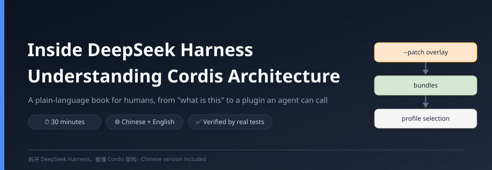
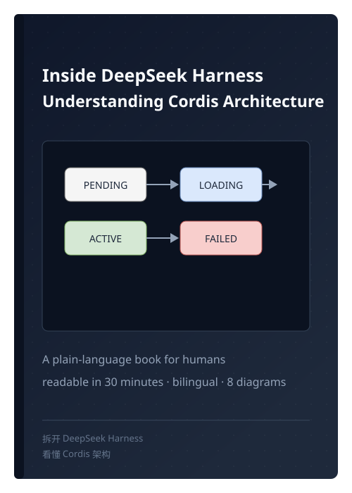
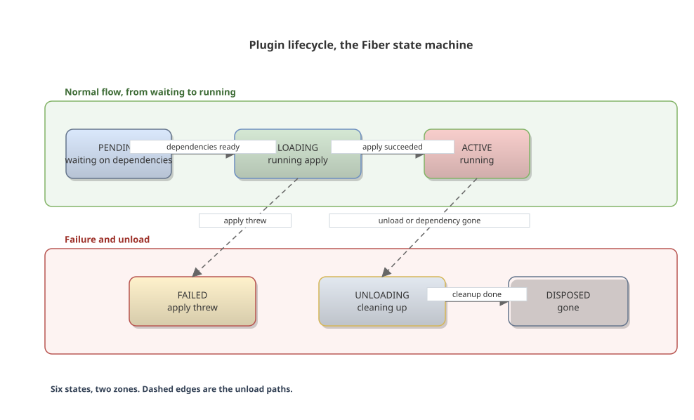

> ✦ This book was written by DeepSeek Harness (dsh), using the very tool it talks about. Writing, diagrams, live verification, and the push to GitHub, one agent ran the whole journey inside dsh. Let an AI do this for you, starting with `npx @deepseek-ai/dsh web`.

# Inside DeepSeek Harness, Understanding Cordis Architecture

[中文](README.md) | **English**

**A plain-language book for humans, readable in 30 minutes**




> The official docs are written for agents. This book is written for humans. In 30 minutes, from "what is this" to "write a plugin an agent can actually call".

DeepSeek Harness (dsh) is an agent harness where everything is a plugin. The AI assistant runs on your own machine, reads and edits the folders you point it at, runs commands, and writes code. This small book explains Cordis, the plugin framework underneath, in plain language, with seven editable figures, in Chinese and English.

## 📖 Read online

The book has a web version, open it in a browser, with one-click language switching, a sidebar table of contents, and syntax highlighting.

**https://Siberia-yuan.github.io/deepseek-harness-human-guide/**

Locally, `book/book.html` is the same page, double-click to open.

## Why this book exists

The official documentation took real effort, but all of that effort went into paving the way for AI reading. The repo's own doc standard explicitly says "do not use metaphors" and "use direct, concrete terms". That standard serves machine-checked contracts well, and it leaves no room for talking to a human reader. The architecture doc opens by suggesting readers "use an agent to explore the codebase and understand its architecture", an honest admission that the docs assume an AI reader. The quickstart's first step sends you to the root README, which is not part of the docs site and gets rewritten into an external GitHub link. A machine-generated config catalog thousands of lines long sits in the same sidebar as pages written for beginners.

This book keeps the other promise. The official docs are a good map, a dictionary, and a cookbook, but nobody walks you through them. This book is that walkthrough.

## What this book does

- Plain language throughout, written against the human-writing standard, with pivot sentences, jargon, colons, and dashes all cleared by the checker
- Verified against the real system, running `dump-config`, loading the hello plugin, executing the greet tool, 20 assertions passing
- Eight editable figures drawn with drawio-skill, gradients, containers, swimlanes, and a real sequence diagram, structurally validated with zero errors, in both Chinese and English variants
- Bilingual, the web version switches language with one click, figures included, the choice remembered in the URL
- Self-contained web version, a single `book.html` file, works offline
- Ships a map to the official docs, Chapter 7 organizes them as map, dictionary, and cookbook, with a lookup table

## What you get

- The official architecture docs stop being a wall of jargon
- A complete walkthrough of a plugin, from load to unload
- A tool you write yourself that an agent can actually call
- A reading order that treats the official docs as a map, a dictionary, and a cookbook



## Table of contents

- Preface
- Chapter 1 What this is
- Chapter 2 How a dsh process is assembled
- Chapter 3 The five concepts of Cordis
- Chapter 4 What happens behind one conversation
- Chapter 5 Replaceable capabilities
- Chapter 6 Hands-on, write a plugin that does work
- Chapter 7 After you finish this book
- Appendix Sources and verification

## How to read it

The book ships in two languages. The web version `book/book.html` has a language toggle in the top-right corner, one click swaps the whole content and the figures to the other language. The two markdown files link to each other at the top.

Chapters 1 to 5 cover concepts, about 20 minutes. Chapter 6 is hands-on, about 10 minutes. Chapter 7 and the appendices point you where to go next, about 5 minutes. Around half an hour in total, if you resist the urge to dive into source code before the concepts settle.

The book includes eight drawio figures, all shipped as editable source files. To tweak any of them, open the `.drawio` file in draw.io.



## The eight figures

| Figure | What it draws | Where it appears |
|---|---|---|
| Everything is a plugin | model adapter, tools, session, agent loop, all swappable parts | Chapter 1, 1.2 |
| Cordis at a glance | plugins, context, events, services, session log in one view | opening of Chapter 3 |
| Plugin tree layers | the five-layer recipe of profile, bundles, patch | Chapter 2 |
| Event dispatch | emit, waterfall, parallel, serial as four panels | Chapter 3, 3.4 |
| Lifecycle | the Fiber state machine, normal flow and failure/unload zones | Chapter 3, 3.5 |
| Context scoping | extend inherits, isolate separates | Chapter 3, 3.6 |
| Turn and step | a real sequence diagram with lifelines and activation bars | Chapter 4 |
| Capability seam | the Service Definition, Provider, Consumer triad | Chapter 5 |

Each figure ships as a `.drawio` source file and a `.svg` render, plus an English variant. `diagrams/viewer-urls.txt` holds the diagrams.net online viewer links.

## How this book was made

Four stages, each with a record left behind.

**Stage one, source verification.** Every fact was checked against the Cordis source under vendor and the docs under docs, page by page. Event names in Chapter 4 were each verified, `agent/turn-stopping` is really dispatched with serial and has no `next`.

**Stage two, plain-language writing.** Written against the human-writing standard, no pivot sentences, no jargon, no promotional colons, no dashes. After the draft, the checker script ran until every violation was zero.

**Stage three, live verification.** The content was run against a real dsh environment. `dsh --profile web --dump-config` printed the real plugin tree, the hello plugin was actually loaded through `ctx.plugin`, the greet tool was defined with `defineTool` and executed, and twenty assertions passed. Verification also caught a real bug, the waterfall example in Chapter 3 was written wrong and has been fixed.

**Stage four, figures and bilingual.** Five figures were drawn with drawio-skill, all structurally validated, then translated one by one into English, and finally the whole book was translated and the web version gained a one-click language toggle.

Version history lives in [CHANGELOG.md](CHANGELOG.md).

## Is this book trustworthy

Everything in it was verified against the real system after the draft was done. `dsh --profile web --dump-config` prints the real plugin tree, matching the layering described in Chapter 2. The hello plugin was actually loaded and run through `ctx.plugin`; the greet tool was defined with `defineTool` and executed; all five concepts in Chapter 3 passed verification, including plugins waiting in PENDING until dependencies are ready, FAILED when `apply` throws, listeners removed automatically on unload, and waterfall short-circuiting when `next()` is not called. `--patch` combined with `--dump-config` confirms the plugins land at the top of the config tree. Two things were not verified, both requiring an API key: model calls themselves, and the full browser UI flow. The verification record is in the appendix at the end of the book.

## Repository layout

```
deepseek-harness-human-guide/
├── README.md                            # Chinese introduction (main README)
├── README.en.md                         # English introduction
├── CHANGELOG.md                         # version history
├── LICENSE                              # MIT
├── assets/
│   ├── cover.svg                        # hero banner
│   └── book-preview.svg                 # book cover preview
├── scripts/
│   ├── render-book.mjs                  # builds the bilingual book.html
│   └── seq/                             # sequence-diagram input for Chapter 4 (zh and en JSON)
└── book/
    ├── cordis-architecture-book.zh.md   # the book, Chinese markdown source
    ├── cordis-architecture-book.en.md   # the book, English markdown source
    ├── book.html                        # the book, bilingual web version with a language toggle
    └── diagrams/                        # five drawio figures, Chinese and English variants
```

## FAQ

**What do I need to know first?** Nothing for chapters 1 to 5. Chapter 6 needs a machine with Node.js (^22.19 or >=24) and pnpm.

**How does this relate to the official docs?** The official docs are a good map, dictionary, and cookbook. This book adds the part where somebody walks you through them. After reading it, the official docs feel precise rather than hostile.

**Why is the book bilingual?** Because the default reader is a human. The book ships in Chinese and English, the web version toggles between them with one click, and the markdown files link to each other at the top. The Chinese version is the primary one.

**Why "30 minutes"?** The prose is about 6,000 Chinese characters plus a small amount of code. The conceptual skeleton alone takes about 30 minutes; following Chapter 6 hands-on takes around 40.

## Related projects

- [DeepSeek Harness official repository](https://github.com/deepseek-ai/deepseek-harness), the architecture this book explains
- [drawio-skill](https://github.com/Agents365-ai/drawio-skill), the tool behind the five figures
- human-writing, the writing standard this book follows, which cleared pivot sentences, jargon, colons, and dashes

## License

[MIT](LICENSE)
