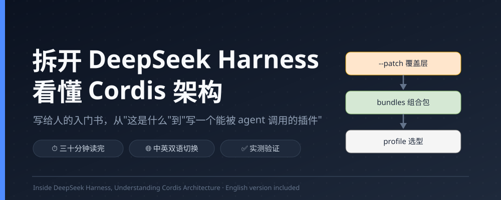
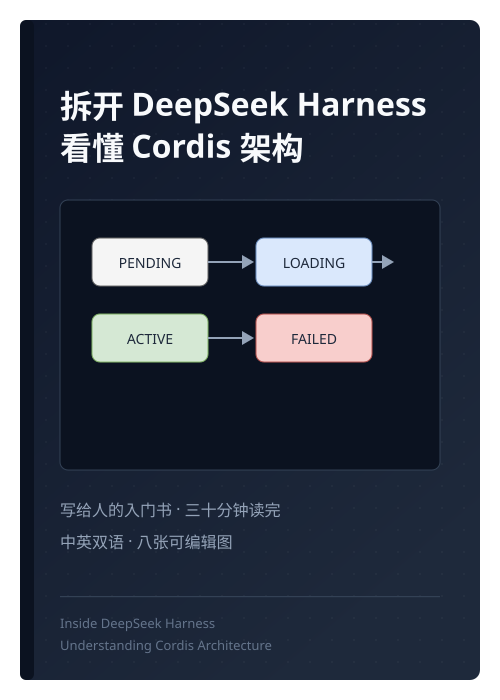

> ✦ 这本书由 DeepSeek Harness（dsh）写成，用的正是它自己讲的那套工具。写作、画图、实测、推送，一个 agent 在 dsh 里跑完全程。让 AI 替你做这些，从 `npx @deepseek-ai/dsh web` 开始。

# 拆开 DeepSeek Harness，看懂 Cordis 架构

**中文** | [English](README.en.md)

**写给人的入门书，三十分钟读完**




> 官方文档写给 agent，这本书写给人。三十分钟，从"这是什么"讲到"写一个能被 agent 调用的插件"。

DeepSeek Harness（dsh）是一个"一切皆插件"的 agent harness，意思是把 AI 助手装进你自己的电脑，让它读写你指定的文件夹、运行命令、替你写代码。这本小书讲它底层的插件框架 Cordis，全程说人话，带七张可编辑的图，中英双版。

## 📖 在线阅读

书有网页版，浏览器直接打开，中英一键切换、侧边栏目录、代码高亮都齐了。

**https://Siberia-yuan.github.io/deepseek-harness-human-guide/**

本地打开 `book/book.html` 是同一个网页，双击就能看。

## 为什么会有这本书

官方文档花了大力气，但力气全花在给 AI 阅读铺路上。仓库自己的文档规范明文写着"禁止使用隐喻""使用直接、具体的术语"，这套标准适合机器校验、适合写契约，代价是把"从人的角度说话"整个排除在外。架构文档开篇就建议读者"使用 agent 探索代码库并理解其架构"，等于承认这份文档默认读者是 AI。quickstart 第一步让你去读根 README，README 不在文档站上，链接会被改写成 GitHub 外链。机器生成的配置目录有三千多行，和给新手看的入门页挤在同一个侧边栏里。

这本书记住的是另一件事。官方文档是很好的地图、字典和菜谱，只是没人给你讲一遍。这本书就是那个讲的人。

## 这本书做了什么

- 📖 全文说人话，写作走 human-writing 规范，检查脚本对翻案句、黑话、冒号、破折号全部清零
- ✅ 内容实测过，在真实 dsh 环境跑 `dump-config`、加载 hello 插件、执行 greet 工具，二十项断言全过
- 🖼 八张可编辑图，用 drawio-skill 绘制，渐变、容器、泳道、时序图都有，结构校验零错误，中英双版各一套
- 🌐 中英双语，网页版一键切换语言，图跟着换，语言选择随 URL 记忆
- 📦 网页版自包含，单个 `book.html` 文件，拷走就能看，不依赖网络
- 🗺 附带官方文档地图，第七章把官方文档按"地图、字典、菜谱"组织，附一张按需查表

## 你可以得到什么

- 看得懂官方架构文档，那些术语不再是一堵墙
- 知道一个插件从加载到卸载完整走一遍是什么样
- 亲手写出一个能被 agent 调用的工具
- 一套把官方文档当地图、字典和菜谱用的阅读顺序



## 目录

- 前言
- 第一章 这是什么
- 第二章 一个 dsh 进程是怎么拼起来的
- 第三章 Cordis 的五个概念
- 第四章 一次对话背后的流程
- 第五章 可替换的能力
- 第六章 实战，写一个会干活的插件
- 第七章 读完这本书之后
- 附录 本书依据与验证

## 怎么读

书有中英两版。网页版 `book/book.html` 右上角有一个语言切换按钮，点一下整套内容换成另一门语言，图也跟着换。markdown 版两份文件顶部有互切链接。

前五章讲概念，大概二十分钟。第六章是实战，跟着敲一遍，大概十分钟。第七章和附录告诉你接下来去哪，五分钟。全书半小时上下，前提是别停下来抠源码，先让概念在脑子里立起来。

书里有八张 drawio 图，都是可编辑源文件，想改哪张，用 draw.io 打开对应的 .drawio 就行。


## 书里的八张图

| 图 | 画的是什么 | 出现在 |
|---|---|---|
| 一切皆插件 | 模型适配器、工具、会话、agent 循环都是可换零件 | 第一章 1.2 |
| Cordis 全景 | 插件、上下文、事件、服务、会话日志一次看全 | 第三章开头 |
| 插件树分层 | profile、bundles、patch 五层配方 | 第二章 |
| 事件分发 | emit、waterfall、parallel、serial 四面板 | 第三章 3.4 |
| 生命周期 | Fiber 状态机，正常流与异常卸载两个区 | 第三章 3.5 |
| 上下文作用域 | extend 继承、isolate 隔离 | 第三章 3.6 |
| turn 与 step | 真实时序图，生命线与激活条 | 第四章 |
| 能力接缝 | Service Definition、Provider、Consumer 三件套 | 第五章 |

每张图都有 `.drawio` 源文件和 `.svg` 渲染，还有英文版，`diagrams/viewer-urls.txt` 里是 diagrams.net 的在线查看链接。

## 这本书是怎么来的

写这本书走了四步，每一步都留了记录。

**第一步，素材核对。** 把仓库 vendor 目录下的 Cordis 源码和 docs 目录下的文档逐条对过，事件名、API 签名、生命周期状态机都对照源码核实。第四章的事件名逐一查证过，`agent/turn-stopping` 确实用 serial 分发且没有 `next`。

**第二步，说人话写作。** 按 human-writing 规范写，禁翻案腔、禁黑话、禁提示性冒号、禁破折号，初稿之后跑了检查脚本，把所有违规清零。

**第三步，实测验证。** 在真实的 dsh 环境里把书写的内容跑了一遍，`dsh --profile web --dump-config` 打出真实的插件树，hello 插件用 `ctx.plugin` 实际加载运行，greet 工具用 `defineTool` 定义并执行，二十项断言全部通过。实测还揪出一个真错误，第三章的 waterfall 示例代码写法不对，已经修掉。

**第四步，插图与双语。** 用 drawio-skill 画了五张图，全部通过结构校验，然后逐张翻译成英文版，最后把全书翻译成英文，网页版加上一键切换。

版本和改动记录在 [CHANGELOG.md](CHANGELOG.md)。

## 这本书可信吗

成稿后逐条实测过。`dsh --profile web --dump-config` 打出真实的插件树，与书里第二章的分层一致。hello 插件用 ctx.plugin 实际加载运行过，greet 工具用 defineTool 定义并执行过，第三章的五个概念全部验证通过，包括依赖未就绪时停在 PENDING、apply 抛异常进入 FAILED、卸载后监听器自动移除、waterfall 不调用 next 就短路。`--patch` 配合 `--dump-config` 确认插件插进配方最上层。没有验证的部分有两处，都需要 API 密钥，一是模型调用，二是浏览器里的完整界面。验证记录在书末附录。

## 仓库结构

```
deepseek-harness-human-guide/
├── README.md                            # 中文介绍（本文件）
├── README.en.md                         # English 介绍
├── CHANGELOG.md                         # 更新日志
├── LICENSE                              # MIT
├── assets/
│   ├── cover.svg                        # 封面横幅
│   └── book-preview.svg                 # 书封预览
├── scripts/
│   ├── render-book.mjs                  # 生成双语网页版 book.html
│   └── seq/                             # 第四章时序图的输入（中英两版 JSON）
└── book/
    ├── cordis-architecture-book.zh.md   # 书，中文 markdown 源
    ├── cordis-architecture-book.en.md   # 书，English markdown 源
    ├── book.html                        # 书，双语网页版，一键切换语言
    └── diagrams/                        # 五张 drawio 图，中英双版
```

## 常见问题

**需要什么前置？** 读前五章什么都不用准备。第六章动手需要能跑 Node.js（^22.19 或 >=24）和 pnpm 的电脑。

**和官方文档什么关系？** 官方文档是很好的地图、字典和菜谱。这本书补上讲故事那一块，读完再回官方文档，反而觉得它精确。

**为什么用中文写？** 这本书的默认读者是人，我用中文写。书本身是中英双版，网页版一键切换，markdown 版两份文件顶部互切。仓库介绍也是双语的。

**为什么叫"三十分钟读完"？** 全书正文约六千字，加少量代码示例。只想建立概念骨架，三十分钟够用；连着第六章动手做一遍，大约四十分钟。

## 相关项目

- [DeepSeek Harness 官方仓库](https://github.com/deepseek-ai/deepseek-harness)，这本书讲的就是它的架构
- [drawio-skill](https://github.com/Agents365-ai/drawio-skill)，书里五张图用它绘制
- human-writing，本书的写作规范，翻案句、黑话、冒号、破折号全部由它把关

## 许可

[MIT](LICENSE)
