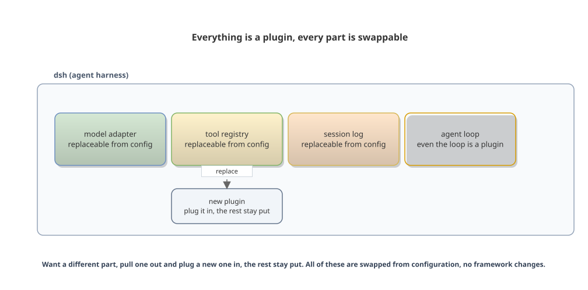
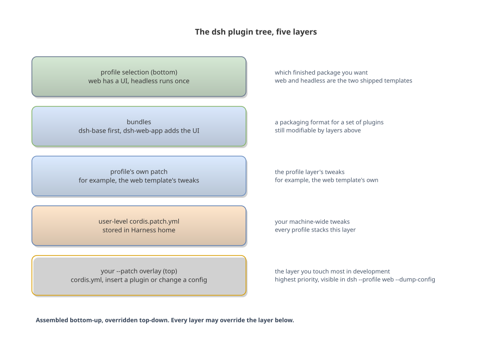
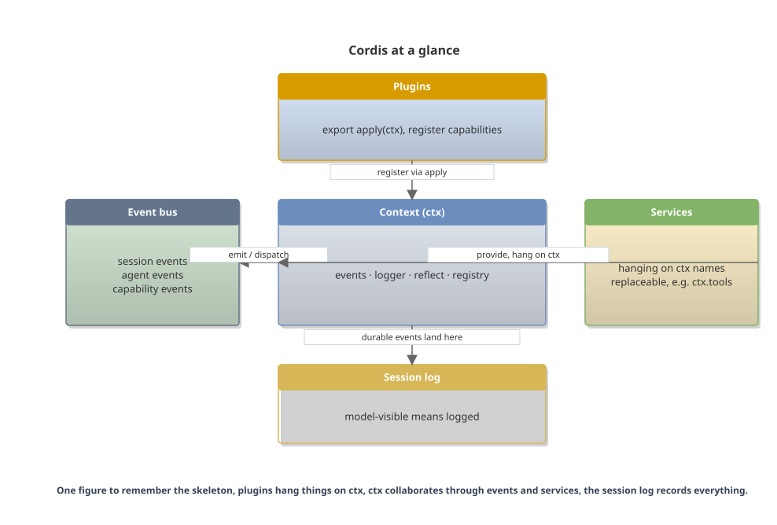
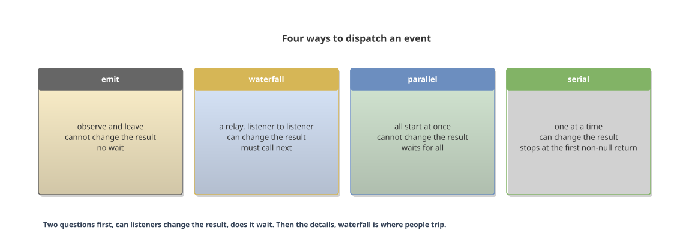
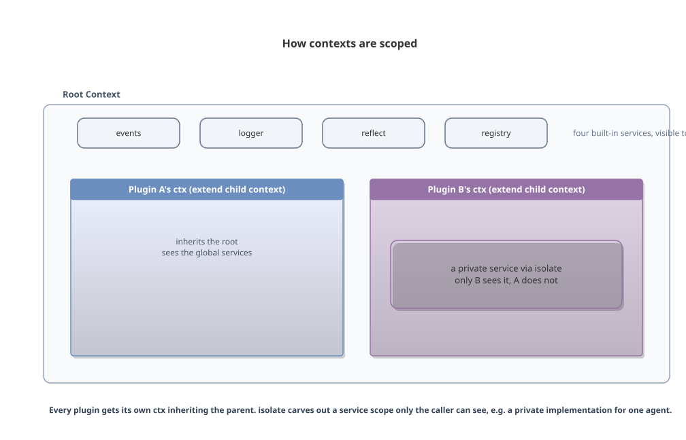
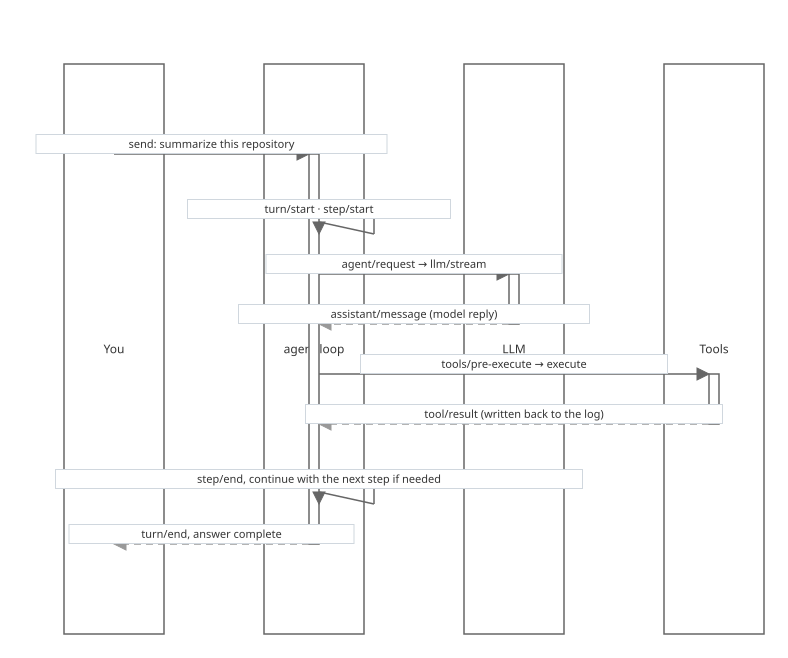
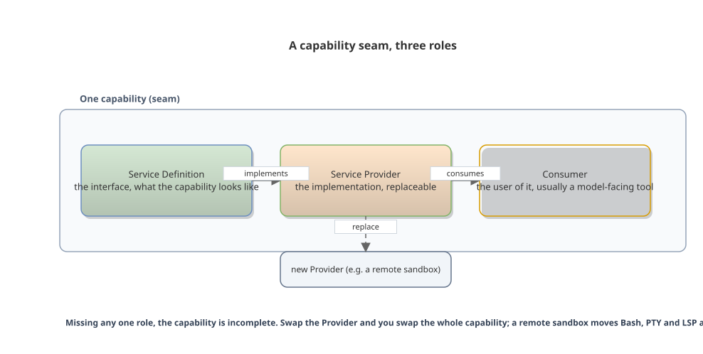

# Inside DeepSeek Harness, Understanding Cordis Architecture

English | [中文](cordis-architecture-book.zh.md)

A plain-language book for humans, readable in 30 minutes

---

## Preface

This book is about Cordis, the plugin framework underneath DeepSeek Harness (dsh), from "what is this" to "write a plugin an agent can actually call".

The official documentation took real effort, but all of that effort went into paving the way for AI reading. **This book assumes a human reader.** It walks through the same material in plain language, with eight editable figures. The official docs are a good map, a dictionary, and a cookbook; this book adds the part where somebody walks you through them.

Chapters 1 to 5 cover concepts, about 20 minutes. Chapter 6 is hands-on, about 10 minutes. Chapter 7 and the appendices point you where to go next, about 5 minutes. Nothing is needed for the first five chapters; Chapter 6 needs a machine with Node.js (^22.19 or >=24) and pnpm. Do not dive into source code before the concepts settle.

## Chapter 1 What this is

This chapter answers one question, what dsh actually is.

### 1.1 What dsh is, and how it differs from a chat window

In the AI products you use every day, the model lives on someone else's server, and so do your files. dsh works the other way around. The model is still remote, but **the agent itself runs in your own process, and the workspace is a local folder**. It reads your code, runs your tests, edits your files, all within your sight.

### 1.2 Everything is a plugin

The other difference is architectural. Most agent tools weld the model, the tools, the memory, and the interface into one piece. To swap one part, you rebuild the whole product, like IKEA furniture assembled as one unit, where replacing one drawer slide means taking half the cabinet apart. dsh is Lego. Standard blocks make up the whole machine, and you pull out the block you want to replace without touching the ones beside it.

dsh makes every piece a plugin. The model adapter is a plugin, the tool registry is a plugin, the session log is a plugin, and the loop that drives the agent's thinking is itself a plugin. **Any of them can be replaced from configuration, with no framework changes.**



Figure Everything is a plugin, every part is swappable

### 1.3 What Cordis is

Cordis is the implementation of that plugin mechanism, and it answers one question. How do a pile of plugins get assembled, who starts first, who talks to whom, and how does disassembly leave no garbage. It is an independent open-source framework, vendored into dsh's repository with a small set of local modifications. Your plugins run on Cordis, so **understanding Cordis covers eighty percent of dsh**.

### 1.4 The reality of developer preview

One thing up front. The project is in developer preview, and the official docs say the compatibility-breaking changes are coming. APIs may change, but the conceptual skeleton of plugins, contexts, services, events, and lifecycles will not move in the near term. Grab concepts while reading, check the source when writing.

### Chapter summary

- dsh installs an AI assistant on your own machine, the agent runs locally, the model stays remote
- Every piece is a plugin, from the model adapter to the agent loop itself, replaceable from configuration
- Cordis is the implementation of that mechanism, answering how plugins are assembled, ordered, wired, and cleaned up
- The project is in developer preview, APIs will change, the conceptual skeleton will not

## Chapter 2 How a dsh process is assembled

This chapter answers one question, how a dsh process gets assembled.

### 2.1 What happens after startup

Run `npx @deepseek-ai/dsh web`, or `pnpm dsh web` from source, and several things happen on your machine.

A Node process starts. The process assembles many plugins according to a recipe, and the result is called the plugin tree. The process serves a web UI at http://127.0.0.1:3080 by default, which you talk to in a browser. You give the agent a workspace, a folder, and the agent's reads, writes, and commands happen inside that folder by default.

### 2.2 The five-layer recipe

The recipe itself is stacked in layers, five from bottom to top.



Figure The dsh plugin tree, five layers assembled bottom-up

### 2.3 profile, bundle, patch

Three terms in plain words. A profile is "which finished package you want", and web and headless are the two templates shipped with the release. A bundle is a packaging format for a set of plugins, still modifiable by layers above it. A patch is the final tweak on top, where you insert a plugin or replace a plugin's configuration.

**Every layer may override the decisions of the layer below.** To see which plugins your machine actually starts, run this.

```sh
dsh --profile web --dump-config
```

### 2.4 Look at the real plugin tree

Concepts alone are not enough. Here is real output. Run the command above in the repository, and it prints the whole config tree. The excerpt below is trimmed.

```yaml
# == @deepseek-ai/dsh-base
- id: llm
  name: '@deepseek-ai/dsh-llm'
- id: session
  name: '@deepseek-ai/dsh-session'
- id: agent
  name: '@deepseek-ai/dsh-agent'
- id: jobs
  name: '@deepseek-ai/dsh-jobs-local'
- id: settings
  name: '@deepseek-ai/dsh-settings-file'
- id: credentials
  name: '@deepseek-ai/dsh-credentials-local'
- id: subprocess
  name: '@deepseek-ai/dsh-subprocess-local'
- id: sandbox
  name: '@deepseek-ai/dsh-sandbox-local'
# == @deepseek-ai/dsh-base, patched by @deepseek-ai/dsh-web-app
- id: hmr
  name: '@deepseek-ai/cordis-plugin-hmr'
  config:
    root:
      - .
  disabled: true
```

The comment `# == @deepseek-ai/dsh-base` on the first line marks the source of this layer, and dsh-base is the base bundle. The second comment `patched by @deepseek-ai/dsh-web-app` shows the entry below was modified by an upper layer, the hmr plugin added by dsh-web-app and disabled by default, with `disabled: true` as the evidence. Every layer's source and changes are written into the comments, which is what "every layer may override the layer below" looks like in reality.

### 2.5 No privileged kernel

Every entry `dump-config` prints can in theory be replaced by your own patch. That is what "no privileged kernel" means. **No block is welded in place**, including the agent loop itself. No piece of the product is untouchable core, which is a real difference from traditional frameworks.

### Chapter summary

- A dsh process assembles plugins into a plugin tree according to a recipe, five layers from bottom to top
- profile picks the finished package, bundles carry the parts, patch is the final tweak
- Every layer can override the layer below, no block is welded in place
- `dsh --profile web --dump-config` shows the real tree any time, with each entry's source in the comments

## Chapter 3 The five concepts of Cordis

This chapter covers five concepts, plugin, context, service, event, and side effect, each standing on the one before it. Start with a one-glance figure that puts all the parts in place, then take them apart one by one. It is grounded in the vendored Cordis source.



Figure Cordis at a glance, plugins, context, events, services, session log

Plugins hang things on ctx, ctx collaborates with the outside world through events and services, and the session log records everything the model sees. The five concepts are the parts in this figure.

### 3.1 A plugin is a module that exports apply

A plugin is a piece of TypeScript that exports an `apply` function. When the framework loads a plugin, it calls apply and hands over a `ctx`.

```ts
import type { Context } from '@deepseek-ai/cordis'

export const name = 'my-plugin'

export function apply(ctx: Context) {
  // Register capabilities here.
}
```

`name` is the plugin's name in the system. `apply` is the plugin's only entry point. **No base class to inherit, no lifecycle methods to implement, a single function is enough.** This is Cordis's deliberate subtraction, and later you will see what that subtraction buys.

### 3.2 The context is a proxy object

`ctx` stands for Context, and the code comment literally says "a context is a proxy". It is a proxy object, whose property reads go through a service resolver. Read `ctx.tools` and you get the tools service, read `ctx.llm` and you get the model service, session history hangs on `ctx.sessions`.

Four services are built in. `ctx.events` handles events, `ctx.logger` handles logs, `ctx.reflect` handles service registration, `ctx.registry` handles plugin loading. Every plugin gets its own `ctx` scoped to itself, and plugins collaborate through the shared context without knowing each other.

Plugins look up services by name on `ctx` rather than importing each other's code. Your plugin depends on a socket standard, not on a specific implementation. **Swap the provider, and what you plugged in does not move.**

### 3.3 A service is a name on ctx

A service is a capability hanging on a `ctx` name. To define one, use the `Service` class. It registers in the constructor and is removed automatically when the owning plugin unloads, which the source states plainly.

```ts
import { Service, type Context } from '@deepseek-ai/cordis'

export default class MyService extends Service {
  constructor(ctx: Context) {
    super(ctx, 'myService')
  }
}
```

If you only consume services, `inject` is enough. The framework waits for dependencies to be ready before loading your plugin, unloads your plugin if a dependency disappears, and reloads it when the dependency comes back. **Load order is derived entirely from dependencies**, with nobody hand-orchestrating a startup sequence.

```ts
export const name = 'my-tool-plugin'
export const inject = ['tools']

export function apply(ctx: Context) {
  // ctx.tools is ready here.
  ctx.tools.register(/* ... */)
}
```

### 3.4 Events are walkie-talkies between plugins

Plugins communicate through events rather than direct phone calls. One plugin dispatches an event, others listen, and the two sides never need to know each other.

There are four dispatch modes, each with explicit semantics in the source.

| Mode | Plain words | Can listeners change the result | Does it wait |
|---|---|---|---|
| emit | observe and leave | no | no |
| waterfall | a relay, listener to listener | yes, later ones override earlier ones | no |
| parallel | all start at once | no | waits for all |
| serial | one at a time | yes | stops at the first non-null return |



Figure Four ways to dispatch an event

waterfall is where people trip. Listeners are registered with `ctx.on`, and the dispatch happens elsewhere via `ctx.waterfall`. The last argument a listener receives is `next`. Calling it passes the baton on. Returning without calling it means every listener behind you never sees the event, and the source comment says it plainly, **listeners must call `next()` to delegate, otherwise the chain short-circuits**.

```ts
ctx.on('some-event', (args, next) => {
  // Change something, then pass the baton on.
  return next()
})
```

This book tripped on this exact spot once. The first draft passed listeners directly to ctx.waterfall, the live test failed, and switching to ctx.on registration fixed it. Forgetting to call next is the same family of bug, when debugging, look at the registration and the pass-the-baton line first.

### 3.5 Registration is a side effect, unload cleans up automatically

This is Cordis's most thoughtful touch. Everything you register on `ctx`, event listeners, tools, adapters, timers, **is revoked automatically when the plugin unloads**. No manual removeListener, no clearInterval.

For resources you hold yourself, tell the framework how to clean up with `ctx.effect`.

```ts
export function apply(ctx: Context) {
  ctx.effect(() => {
    const timer = setInterval(() => console.log('heartbeat'), 5000)
    return () => clearInterval(timer)  // Runs when the plugin unloads.
  })
}
```

This design brings one cascading benefit, hot reload works safely. Change the code, the old plugin unloads, every registration is cleaned, the new plugin loads. No ghost listeners from old instances.

The lifecycle state machine looks like this.

| State | Meaning |
|---|---|
| PENDING | waiting on dependencies |
| LOADING | running apply |
| ACTIVE | running |
| FAILED | apply threw |
| UNLOADING | cleaning up |
| DISPOSED | gone |


Figure Plugin lifecycle, Fiber state machine

### 3.6 Scoping, every plugin has its own ctx

The chapter said every plugin gets its own ctx, scoped to itself. That sentence deserves a closer look.

The framework creates a root Context at startup, with four built-in services. Every time a plugin loads, it extends a child context from its parent's ctx, inheriting everything the parent sees. What the plugin registers on its child ctx disappears with the child on unload, without polluting the root.

Inheritance alone is not enough. `isolate` carves out an independent service scope, for example giving one agent a private implementation that other plugins cannot see. In dsh, every agent has its own ctx, called agent.ctx, and a plugin can declare that it serves only that one agent, which is the basis of per-agent isolation.



Figure How contexts are scoped, extend inherits, isolate separates

One line to remember, **extend inherits downward, isolate separates outward**.

### 3.7 Config is validated, wrong config fails at load

When a plugin is mounted through cordis.yml, the config is not free-form. Cordis's loader validates the config against the plugin's Config schema, and a wrong config fails at load time, rather than silently running with broken settings.

The mechanism lives in the patch layer. The config you fill in for a plugin is checked entry by entry, wrong types and unknown fields are reported at startup. **Failing loud on misconfiguration is a deliberate design**, so you never discover hours later that your config never took effect.

### 3.8 Nesting and hot reload

Plugins can mount plugins. `ctx.plugin()` loads a child plugin with its own Fiber, and unloading the parent tears down the children with it, with no per-child cleanup.

The unload order has rules too. Registered disposers run in reverse registration order, later registered first, and multiple async disposers run concurrently without a guarantee of individual completion. Cleanup steps that depend on order must go into the same ctx.effect, which serializes them itself.

Put those rules together and you get the reason hot reload is safe. The HMR plugin does three things, unload the old plugin, every registration is revoked automatically, load the new plugin. No leftovers, no ordering problems, saving the file takes effect.

### Chapter summary

- A plugin is a module exporting apply, ctx is a proxy object, a service is a capability on a ctx name
- inject declares dependencies, load order is derived from them
- Four dispatch modes, waterfall must call next or it short-circuits
- Registration is a side effect, unload cleans up automatically, hot reload is safe because of it
- Six lifecycle states, waiting, loading, running, failed, cleaning up, gone
- Scoping works through extend inheriting and isolate separating, wrong config fails at load, nested plugins tear down with the parent

## Chapter 4 What happens behind one conversation

This chapter strings the five concepts together and watches one real conversation inside the process.

### 4.1 step and turn

You send "summarize this repository" in the web UI, and what happens in the process can be read on two levels.

The first level is the step. **A step is one model request plus the tool calls it makes.** The model says "I need to see the file list first", that is a request, the tool runs and the result comes back, and only then does the step end. If the model asks another request after seeing the result, the next step begins.

The second level is the turn. **It starts when you send a message and ends when the agent owes no more work.** A turn usually contains several steps, because the model often calls tools repeatedly to finish a task. Turn opening and closing each have an event, and step opening and closing each have one too.

### 4.2 The full journey of one conversation

Put the two levels together, and the full flow looks like this.



Figure One conversation, turn and step

### 4.3 Events are the extension points

Events are the extension points themselves; the flow is just their byproduct. dsh's events fall into three groups by purpose.

Session events are durable facts appended to the log, `turn/start`, `step/end`, and `tool/result` belong to this group, use them for facts that must survive a reload. Agent events carry the live agent, `agent/request`, `agent/pre-step`, and `agent/turn-stopping` belong here, use them to observe or intercept work in progress. Capability events attach policy and adapters to a seam, `tools/pre-execute` and `tools/post-execute` belong here.

**Picking the right event group is the first decision of most changes.**

### 4.4 The session log, model-visible means logged

The session log is the root of the whole flow. Everything that reaches a model request must be reconstructable from the log, which is a design goal stated in the architecture doc. **Whatever the model sees, the log holds.** Because of that rule, sessions can be forked, resumed, replayed, and the web UI can render the full history.

The rule has one direct consequence. To feed the model a new kind of context, you must add a new kind of session event, because everything the model sees must be reconstructable from the log. Extending `SessionEventMap` and rendering from the log is the standard move for "adding model-visible input" in dsh.

### Chapter summary

- A step is one model request plus the tools it calls, a turn runs from your message until the agent owes no more work
- The whole flow is made of events, observable and interceptable
- Events fall into three groups, session, agent, and capability, picking the right group is the first decision of a change
- Model-visible means logged, new model-visible input requires a new session event

## Chapter 5 Replaceable capabilities

This chapter covers one concept, the seam, a replaceable capability boundary.

### 5.1 The seam triad

Chapter 2 said no block is welded in place. This section is about how that lands. A seam is always a triad. The Service Definition declares the interface, what the capability looks like. The Service Provider is the concrete implementation, replaceable. The Consumer is the user of it, usually a model-facing tool. **Missing any one role, the capability is incomplete.**



Figure A capability seam, three roles

### 5.2 Swap one part, the whole line changes

Take the filesystem. dsh's filesystem, processes, and terminals share one execution world. Swap the filesystem Provider from local to a remote sandbox, and Bash, PTY, and LSP move along with it, with no per-tool remote implementation needed. **Swap one part, and the whole production line changes.**

One more example, subagent. It is also a seam. Its Provider can spawn a fresh sub-agent, or delegate a turn to a completely different product. The interface does not move, the behavior is worlds apart.

To add something new to dsh, the official architecture doc has a table mapping "what I want to do" to "which mechanism to use". The excerpt below is trimmed.

| Goal | Mechanism |
|---|---|
| add a model provider | register its adapter on ctx.llm |
| add a model-facing capability | register on ctx.tools, the schema joins prompt assembly |
| add shell execution | register a ctx.shell backend |
| add filesystem access or policy | register a ctx.fs provider, or listen to fs/* events |
| intercept requests, tools, or turns | use the corresponding agent/* or tools/* events |
| add model-visible context | call agent.inject() |

### 5.3 A judgment rule

To add a new capability, **design the interface, the implementation, and the consumer together. To replace an existing capability, swap only the Provider.** When writing a plugin, ask which of the three roles you occupy, which is the most common starting question among dsh developers.

### Chapter summary

- A seam is always a triad, interface, implementation, and consumer
- Swap the Provider and you swap the whole capability, a remote sandbox moves Bash, PTY, and LSP along with it
- To add, design all three together, to replace, swap only the Provider
- Ask which role you occupy before writing a plugin

## Chapter 6 Hands-on, write a plugin that does work

This chapter is hands-on. The goal is a tool an agent can call, in about ten minutes. You end up with a hello plugin and a greet tool.

### 6.1 Prepare the environment

Running from source makes debugging easier.

```sh
git clone https://github.com/deepseek-ai/deepseek-harness.git
cd deepseek-harness
pnpm install
pnpm run build
```

Create a scratch directory in the repo root.

```sh
mkdir -p scratch-plugin/src
```

### 6.2 Write the minimal plugin

Create `scratch-plugin/src/my-plugin.ts`.

```ts
import type { Context } from '@deepseek-ai/cordis'

export const name = 'hello-plugin'

export function apply(ctx: Context) {
  console.log('[hello-plugin] plugin loaded!')
}
```

At this point you are writing a real Cordis plugin. It does one thing, printing one line of log on load.

### 6.3 Make dsh load it

Create `scratch-plugin/cordis.yml`. **The path must be absolute**, the most common place to get stuck.

```yaml
- insert:
    - id: hello
      name: '/absolute/path/to/deepseek-harness/scratch-plugin/src/my-plugin.ts'
```

Start with this overlay.

```sh
pnpm dsh web --patch ./scratch-plugin/cordis.yml
```

Open http://127.0.0.1:3080, and the startup log shows `[hello-plugin] plugin loaded!`. `--patch` stacks your config at the top of the recipe, and `insert` drops a new block into the plugin tree. No framework code was touched.

### 6.4 Add a tool

Replace `my-plugin.ts` with the following. This is the standard posture for giving the agent a new capability in dsh.

```ts
import type { Context } from '@deepseek-ai/cordis'
import { defineTool } from '@deepseek-ai/dsh-tools'

export const name = 'greet-tool'
export const inject = ['tools']

export function apply(ctx: Context) {
  ctx.tools.register(defineTool({
    name: 'greet',
    description: 'Greet someone by name.',
    parameters: {
      name: { type: 'string', required: true, description: 'The name to greet' },
    },
    output: {
      schema: { type: 'string' },
      render: (_args, value) => [{ type: 'text', text: value }],
    },
    async execute(args) {
      return `Hello, ${args.name}!`
    },
  }))
}
```

Restart, send `Use the greet tool to greet Ada.`, and the model calls greet and sees `Hello, Ada!`.

The four parts of a tool each have their own job. description is the manual for the model, which uses it to decide when to call. parameters declares arguments, and the framework derives and validates the types. execute does the work, and its return value must fit output.schema. render turns the result into a UI presentation, a separate concern from what the model sees.

**You register a tool, and its schema automatically joins the model's available-skills list.** Prompt assembly is the framework's job. That is dsh's product philosophy, capabilities are exposed to the model as tools, and everything else goes to the framework.

### 6.5 Watch the lifecycle

Change the plugin to this, restart, and watch the log.

```ts
import type { Context } from '@deepseek-ai/cordis'

export function apply(ctx: Context) {
  console.log('plugin loading')

  ctx.effect(() => {
    console.log('effect registered')
    return () => console.log('effect cleaned up')
  })
}
```

On load it prints `plugin loading` and `effect registered`. On shutdown it prints `effect cleaned up`. That one line is the automatic unload cleanup from Chapter 3, witnessed live.

### 6.6 Three forms, when to use which

| Form | Shape | When to use |
|---|---|---|
| function | `export function apply(ctx)` | the vast majority of cases, simplest, enough |
| object | `export default { name, inject, apply }` | package name, inject, and apply into one export |
| class | `class MyService extends Service` | your plugin provides a service that others inject |

**Start with the function form, and upgrade to the class only when someone needs your service.**

### 6.7 Dev tools

To avoid restarting on every change, load `@deepseek-ai/cordis-plugin-hmr`, and saving a file hot-reloads. To confirm you are really loaded, watch the startup log, or run `dsh --profile web --dump-config` and find your plugin in the config tree.

### 6.8 Common pitfalls

- The plugin path is relative and the loader cannot find the module, it must be absolute
- Code changes do not take effect, plugins load only at startup, restart or load the HMR plugin
- Not sure whether a plugin loaded, check the startup log or search the dump-config output for its id
- Using services like `tools` or `llm` without declaring `inject`, and finding nothing in apply

### Chapter summary

- A plugin is a module exporting apply, the framework hands you ctx on load
- `--patch` inserts your plugin at the top of the recipe, the path must be absolute
- defineTool defines a tool, its schema automatically joins the model's skill list
- Registrations clean up automatically, hot reload is safe, start with the function form

## Chapter 7 After you finish this book

This chapter points you where to go after the book.

### 7.1 The lookup table

The official docs are worth reading, only nobody tells you the order. The table below indexes by "what you want to do". The first column is the question in your head, the other two are the location and the warning.

| I want to ... | Read | Plain-language note |
|---|---|---|
| run it and see what it looks like | docs/user/guide/index.md, the quickstart | configure a model, pick a workspace, send a message, five minutes |
| understand the project's architecture | docs/architecture.md | after this book, it reads much smoother |
| write my first plugin | docs/user/develop/basic/index.md | the original of Chapter 6 |
| give the agent a tool | docs/user/develop/basic/tool.md, then docs/cookbook/adding-a-tool.md | the latter covers nested schemas, background jobs, policy hooks |
| make a plugin configurable | docs/user/develop/basic/config.md | |
| add a model provider | docs/user/guide/providers.md, then docs/cookbook/adding-an-llm-adapter.md | the providers page has screenshots, a rare human-friendly page |
| fully understand Cordis | docs/cordis-tutorial/, seven chapters | build a scratch project, chapter by chapter, no API key |
| change the agent loop or behavior | docs/agent-lifecycle.md, details in docs/subsystems/core.md | know turn and step before going in |
| check what a config key supports | docs/config-catalog.md | machine-generated, look it up, do not read front to back |
| see every tool schema | docs/tool-catalog.md | same, machine-generated, use as a dictionary |
| contribute code, daily workflow | docs/development.md | |

### 7.2 A route from front to back

Besides the table, there is one order for reading front to back.

```text
① This book, 30 minutes, build the mental model
   ↓
② cordis-tutorial, seven chapters, an afternoon building the framework yourself
   ↓
③ Chapter 6 hands-on, write your first plugin and tool
   ↓
④ On demand, architecture is the map, subsystems is the dictionary, cookbook is the recipe book
```

Step ④ is where the official docs take over. They are a good map, dictionary, and cookbook, and this book has already done the walking-you-through part. Look things up on demand, and write.

One last sentence. dsh is young, APIs will change, but this skeleton is worth your 30 minutes. It took an agent framework apart into freely re-assemblable blocks, and now it is your turn to assemble one.

## Appendix Sources and verification

Concepts and code follow docs/architecture.md, docs/cordis-primer.md, the tutorials under docs/user/develop/basic, and the source under vendor/cordis/src. API signatures follow the master branch; check the source first when signatures change.

The eight figures are .drawio files generated with drawio-skill (Agents365-ai, 7.2k stars on GitHub). The .svg files next to them are rendered previews, the .drawio files stay editable in the draw.io desktop app, and diagrams/viewer-urls.txt holds the diagrams.net online viewer links.

Everything in this book was verified against the real system after the draft was done. `dsh --profile web --dump-config` prints the real plugin tree, matching the layering in Chapter 2. The hello plugin was actually loaded and run through ctx.plugin, the greet tool was defined with defineTool and executed, and all five concepts in Chapter 3 passed verification, including plugins waiting in PENDING until dependencies are ready, FAILED when apply throws, listeners removed automatically on unload, and waterfall short-circuiting when next() is not called. `--patch` combined with `--dump-config` confirms the plugins land at the top of the config tree. The event names in Chapter 4 were each checked against the source, and agent/turn-stopping is dispatched with serial and has no next. Two things were not verified, both requiring an API key, model calls themselves and the full browser UI flow.
