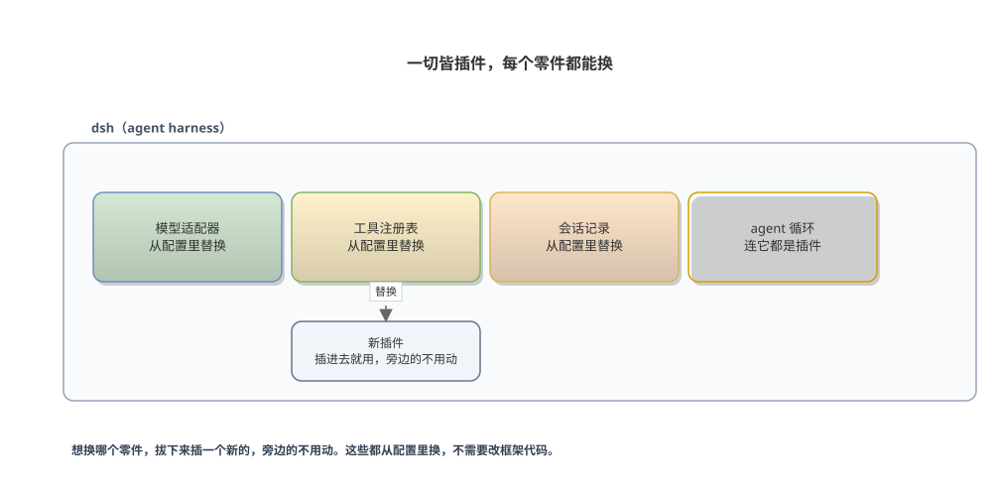
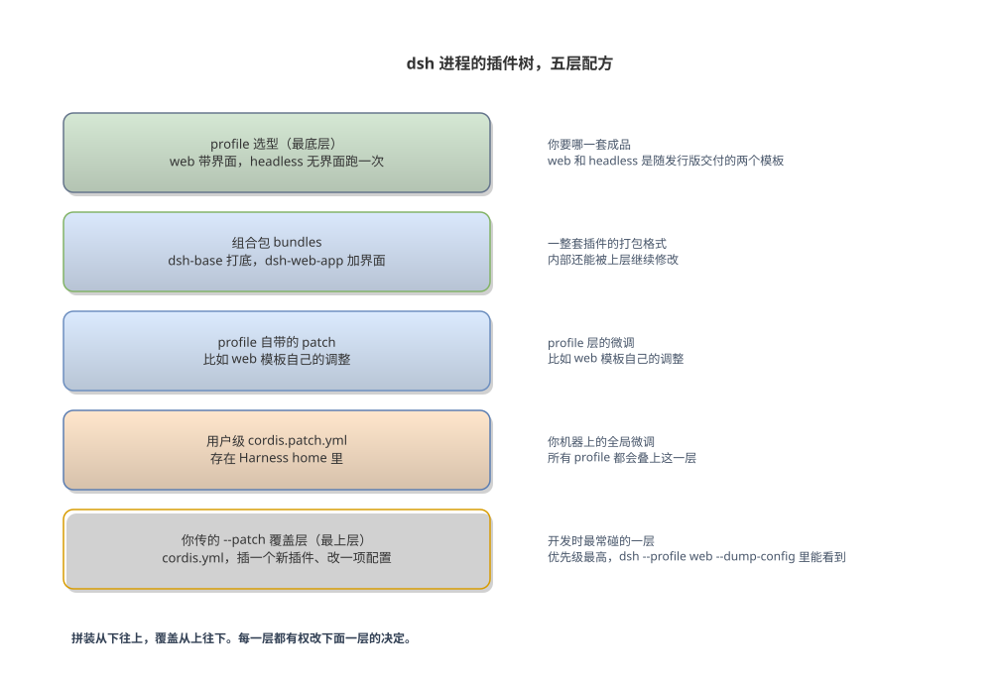
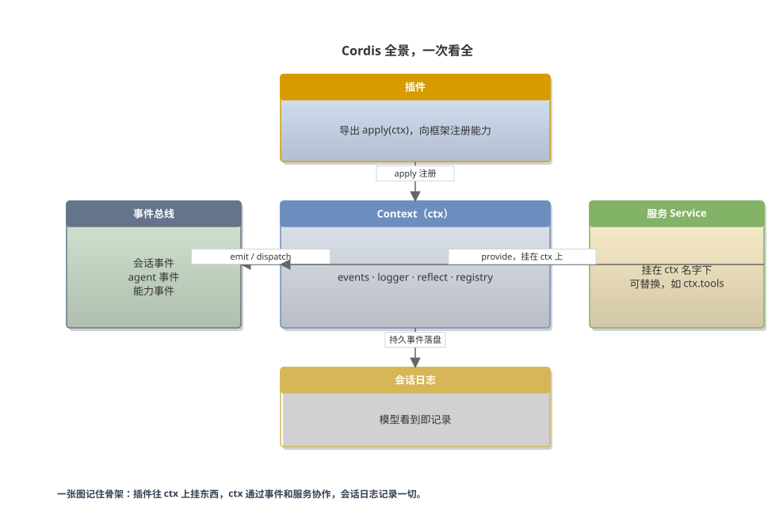
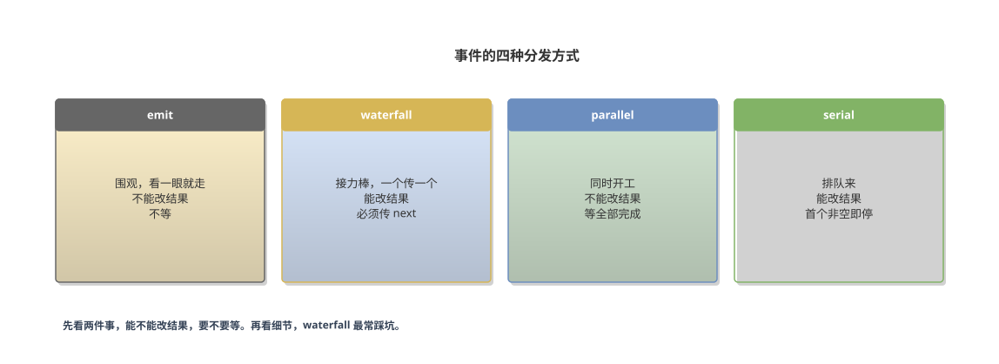
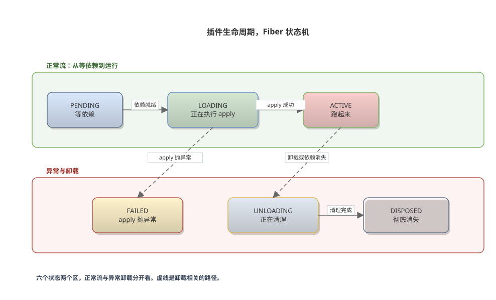
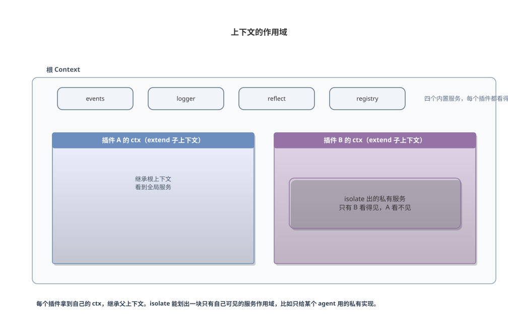
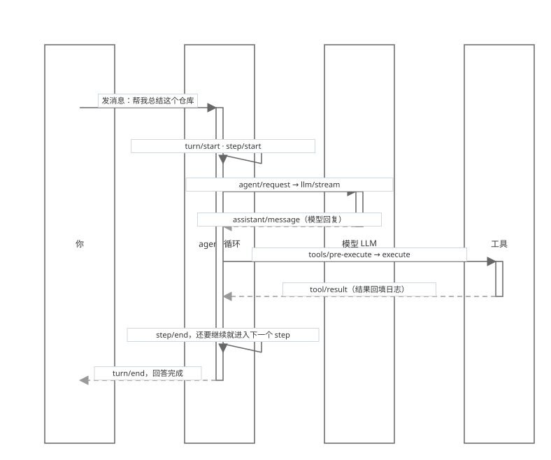
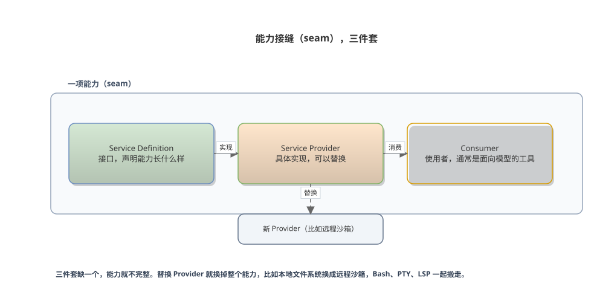

# 拆开 DeepSeek Harness，看懂 Cordis 架构

[English](cordis-architecture-book.en.md) | 中文

一本给普通人读的入门书，三十分钟读完

---

## 前言

这本书讲 DeepSeek Harness（dsh）底层的插件框架 Cordis，从"这是什么"讲到"写一个能被 agent 调用的插件"。

官方文档花了大力气，但力气全花在给 AI 阅读铺路上。**这本书默认读者是人**，用大白话把同一套内容讲一遍，配八张可编辑的图。官方文档是很好的地图、字典和菜谱，这本书补上讲故事那一块。

前五章讲概念，大概二十分钟。第六章动手，跟着敲一遍，大概十分钟。第七章和附录告诉你接下来去哪，五分钟。读前五章不需要任何准备，第六章需要能跑 Node.js（^22.19 或 >=24）和 pnpm 的电脑。别急着抠源码，先让概念在脑子里立起来。

## 第一章 这是什么

这一章回答一个问题，dsh 到底是什么。

### 1.1 dsh 是什么，跟聊天窗口有什么区别

你平时用的 AI 产品，模型在别人的服务器上，你的文件也在别人的服务器上。dsh 反着来。模型仍然在远端，但 **agent 本身跑在你自己的进程里，工作区是你本地的文件夹**。它读你的代码、跑你的测试、改你的文件，每一步都在你眼皮底下发生。

### 1.2 一切皆插件

另一个区别藏在架构里。市面上多数 agent 工具把"模型、工具、记忆、界面"焊成一个整体，你想换掉其中一块，得动整个产品，像整装的宜家家具，想换一个抽屉的滑轨得拆掉半面柜子。dsh 是乐高，标准积木拼成整台机器，想换哪块就拔下来换一块新的，旁边的积木不用动。

dsh 把每一块都做成插件。模型适配器是插件，工具注册表是插件，会话记录是插件，连驱动 agent 反复思考的那个循环本身也是插件。**任何一个都可以从配置里替换，不需要改框架代码**。



图 一切皆插件，每个零件都能换

### 1.3 Cordis 是什么

Cordis 就是这一套插件机制的实现，负责回答一个问题。一堆插件怎么拼在一起、谁先启动、谁跟谁通信、拆的时候怎么不留垃圾。它本身是一个独立的开源框架，dsh 把它以 vendor 方式搬进仓库，做了少量本地修改。你写的插件跑在 Cordis 的运行时上，所以 **懂 Cordis，就懂 dsh 的八成**。

### 1.4 开发者预览期的现实

还有一件事要提前说。项目在开发者预览阶段，官方自己标注了"会有破坏兼容性的变更"。API 可能变，但"插件、上下文、服务、事件、生命周期"这套概念骨架短期内不会动。看书的时候抓概念，写代码的时候查源码。

### 本章小结

- dsh 把 AI 助手装进你自己的电脑，agent 跑在本地，模型在远端
- 每一块都是插件，从模型适配器到 agent 循环本身，都可以从配置替换
- Cordis 是这套机制的实现，回答插件怎么拼、谁先启动、怎么通信、拆了怎么不留垃圾
- 项目在开发者预览期，API 会变，概念骨架不会变

## 第二章 一个 dsh 进程是怎么拼起来的

这一章回答一个问题，一个 dsh 进程是怎么拼起来的。

### 2.1 启动之后发生了什么

运行 `npx @deepseek-ai/dsh web`，或者从源码跑 `pnpm dsh web`，你的电脑上发生了这样几件事。

一个 Node 进程启动。进程按一套配方把许多插件拼装起来，拼装的结果叫插件树。进程起了一个 Web 服务器，默认地址是 http://127.0.0.1:3080，你在浏览器里跟它对话。你给 agent 指定一个工作区，一个文件夹，agent 的读写和命令默认都发生在这个文件夹里。

### 2.2 五层配方

配方本身是分层叠出来的，从下到上五层。



图 dsh 进程的插件树，自下而上五层配方

### 2.3 profile、组合包、patch

三个术语用人话说清楚。profile 是"你要哪一套成品"，web 和 headless 是随发行版交付的两个模板。组合包是一整套插件的打包格式，内部还能被上层继续修改。patch 是叠在最上面的微调，插一个插件、替换一个插件的配置，都走这一层。

**每一层都有权改变下面一层的决定**。想知道你的机器实际启动了哪些插件，跑这条命令。

```sh
dsh --profile web --dump-config
```

### 2.4 看真实的插件树

光讲概念不够，直接看真实的输出。在仓库里跑上面那条命令，会打印一整棵配置树，下面是节选。

```yaml
# == @deepseek-ai/dsh-base
- id: llm
  name: '@deepseek-ai/dsh-llm'
- id: session
  name: '@deepseek-ai/dsh-session'
- id: agent
  name: '@deepseek-ai/dsh-agent'
- id: jobs
  name: '@deepseek-ai/dsh-jobs-local'
- id: settings
  name: '@deepseek-ai/dsh-settings-file'
- id: credentials
  name: '@deepseek-ai/dsh-credentials-local'
- id: subprocess
  name: '@deepseek-ai/dsh-subprocess-local'
- id: sandbox
  name: '@deepseek-ai/dsh-sandbox-local'
# == @deepseek-ai/dsh-base, patched by @deepseek-ai/dsh-web-app
- id: hmr
  name: '@deepseek-ai/cordis-plugin-hmr'
  config:
    root:
      - .
  disabled: true
```

第一行注释 `# == @deepseek-ai/dsh-base` 标出这一层的来源，dsh-base 就是组合包里的打底层。第二组注释 `patched by @deepseek-ai/dsh-web-app` 说明下面的条目被上层改过，hmr 插件是 dsh-web-app 加进来的，又默认关掉了，`disabled: true` 就是证据。每一层的来源和改动都写在注释里，这就是"每一层都有权改下面一层的决定"的真实样貌。

### 2.5 没有特权内核

`dump-config` 打印出来的每个条目，理论上都能被你的 patch 替换。这就是"没有特权内核"的意思。**没有任何一块积木是焊死的**，包括 agent 循环本身。整个产品没有一段代码是"碰不得的核心"，这跟传统框架有本质区别。

### 本章小结

- dsh 进程按配方把插件拼成插件树，配方从下到上五层
- profile 选成品，组合包装零件，patch 做微调
- 每一层都能改下面一层的决定，没有任何积木是焊死的
- `dsh --profile web --dump-config` 随时能看真实的插件树，注释里标着每一条的来源

## 第三章 Cordis 的五个概念

这一章讲五个概念，插件、上下文、服务、事件、副作用，后面一个踩着前面一个。先看一张全景图，把零件的位置一次放全，再一个个拆开讲。这一章对照 vendor 里的 Cordis 源码讲。



图 Cordis 全景，插件、上下文、事件、服务、会话日志

插件往 ctx 上挂东西，ctx 通过事件和服务跟外界协作，会话日志把模型看到的一切记下来。五个概念就是这张图里的零件。

### 3.1 插件是一个导出 apply 函数的模块

插件就是一段 TypeScript，导出 `apply` 函数。框架加载插件时调用它，递进来一个 `ctx`。

```ts
import type { Context } from '@deepseek-ai/cordis'

export const name = 'my-plugin'

export function apply(ctx: Context) {
  // 在这里注册能力
}
```

`name` 是插件在系统里的名字。`apply` 是插件唯一的入口。**没有基类要继承，没有生命周期方法要实现，一个函数就够了**。这是 Cordis 刻意做的减法，你后面会看到这套减法换来的是什么。

### 3.2 上下文是一个代理对象

`ctx` 全名叫 Context，代码里它的注释写着 "a context is a proxy"。它是一个代理对象，读它的属性会走到服务解析器。读 `ctx.tools` 拿到工具服务，读 `ctx.llm` 拿到模型服务，会话历史挂在 `ctx.sessions` 上。

内置服务有四个。`ctx.events` 管事件，`ctx.logger` 管日志，`ctx.reflect` 管服务注册，`ctx.registry` 管插件装载。每个插件拿到的 `ctx` 都长在自己的作用域里，插件之间通过共享的上下文协作，互相不认识也能配合。

插件之间通过 `ctx` 上的名字查找服务，不直接 import 对方的代码。你的插件依赖的是"插座标准"，不是某个具体实现。**换一个提供方，你插的东西纹丝不动**。

### 3.3 服务是挂在 ctx 上的名字

一个服务就是挂在 `ctx` 某个名字下的能力。定义服务用 `Service` 类，构造时注册，所属插件卸载时自动移除，这一行逻辑在源码里写得很直白。

```ts
import { Service, type Context } from '@deepseek-ai/cordis'

export default class MyService extends Service {
  constructor(ctx: Context) {
    super(ctx, 'myService')
  }
}
```

如果你只是消费服务，用 `inject` 声明依赖就够了。框架会等依赖就绪再加载你的插件，依赖消失就自动卸载你的插件，恢复后再加载。**加载顺序完全由依赖关系推导**，不需要任何人手动编排启动序列。

```ts
export const name = 'my-tool-plugin'
export const inject = ['tools']

export function apply(ctx: Context) {
  // 走到这里时，ctx.tools 一定已经就绪
  ctx.tools.register(/* ... */)
}
```

### 3.4 事件是插件之间的对讲机

插件之间靠事件通信，不直接打电话。一个插件触发事件，其他插件监听，双方不需要认识。

事件有四种分发方式，源码里每种都有明确的语义。

| 方式 | 人话 | 监听器能改结果 | 要不要等 |
|---|---|---|---|
| emit | 围观，看一眼就走 | 不能 | 不等 |
| waterfall | 接力棒，一个传一个 | 能，后传的盖过前面的 | 不等 |
| parallel | 同时开工 | 不能 | 等全部 |
| serial | 排队来 | 能 | 等第一个叫停 |



图 事件的四种分发方式

waterfall 最容易踩坑。监听器先用 `ctx.on` 注册，分发发生在别处调用 `ctx.waterfall` 的地方。监听器拿到的参数最后一个是 `next`，调用它才把接力棒传下去。不调用直接返回，后面的监听器全都看不见这个事件，源码注释里写得很清楚，**监听器必须调用 `next()` 委托，否则短路**。

```ts
ctx.on('some-event', (args, next) => {
  // 改点东西，然后必须把棒子传下去
  return next()
})
```

这本书自己就栽过一回。初稿把监听器直接传给了 ctx.waterfall，实测一跑就报错，改成 ctx.on 注册才通过。忘传 next 是同一个家族的坑，排查时先看注册和传棒这两行。

### 3.5 注册即副作用，卸载自动撤销

这是 Cordis 最贴心的一笔。你在 `ctx` 上做的任何注册，事件监听、工具、适配器、定时器，**插件卸载时全部自动撤销**。你不需要手动 removeListener，不需要 clearInterval。

自己捏在手里的资源要用 `ctx.effect` 告诉框架怎么清理。

```ts
export function apply(ctx: Context) {
  ctx.effect(() => {
    const timer = setInterval(() => console.log('heartbeat'), 5000)
    return () => clearInterval(timer)  // 插件卸载时调用
  })
}
```

这个设计带来一个连锁好处，热重载可以安全地工作。改代码，旧插件卸载，所有注册清干净，新插件加载。不会出现旧监听器残留的灵异事件。

配套的生命周期状态机长这样。

| 状态 | 含义 |
|---|---|
| PENDING | 等依赖 |
| LOADING | 正在执行 apply |
| ACTIVE | 跑起来 |
| FAILED | apply 抛异常 |
| UNLOADING | 正在清理 |
| DISPOSED | 彻底消失 |



图 插件生命周期 Fiber 状态机

### 3.6 作用域，每个插件一块自己的 ctx

第三章开头说过，每个插件拿到的 ctx 都长在自己的作用域里。这句值得拆开看。

框架启动时建一个根 Context，内置四个服务。每加载一个插件，就从它父级的 ctx 上 extend 出一个子上下文，继承父级能看到的一切。插件在子 ctx 上注册的东西，卸载时跟着子 ctx 一起消失，不污染根。

光继承还不够。`isolate` 能划出一块独立的服务作用域，比如给某个 agent 单独装一个私有实现，别的插件看不见。dsh 里每个 agent 都有一块自己的 ctx，叫 agent.ctx，插件可以声明只服务这一个 agent，这是按 agent 隔离的基础。



图 上下文的作用域，extend 继承，isolate 隔离

一句话记住，**extend 往下继承，isolate 往外隔离**。

### 3.7 配置会校验，配错加载即失败

插件挂进 cordis.yml 时，配置不是随便写的。Cordis 的 loader 会拿插件的 Config schema 校验配置，配错了在加载时就报错，不会带着错误配置悄悄跑起来。

这套机制就藏在 patch 层里。你给插件填的 config，会被逐条校验，类型不对、字段不认识，启动时就告诉你。**配错即失败是刻意的设计**，省得你上线半天才发现配置根本没生效。

### 3.8 嵌套与热重载

插件可以挂插件。`ctx.plugin()` 加载一个子插件，子插件有自己的 Fiber，卸载父级时子级跟着拆，不用逐个清理。

卸载的顺序也有规矩。注册的 disposer 按逆序调用，也就是后注册的先清理，多个异步 disposer 并发执行，不保证逐个完成。有顺序要求的清理步骤，必须放进同一个 ctx.effect 里，由它自己串行。

这一套规矩拼起来，就是热重载能安全工作的原因。HMR 插件做的事就三步，卸载旧插件，所有注册自动撤销，加载新插件。没有残留，没有顺序问题，改完代码保存就生效。

### 本章小结

- 插件是导出 apply 的模块，ctx 是代理对象，服务是挂在 ctx 名字下的能力
- inject 声明依赖，加载顺序由依赖关系推导
- 事件四种分发，waterfall 必须传 next，否则短路
- 注册即副作用，卸载自动撤销，热重载因此安全
- 生命周期六个状态，等依赖、加载、运行、失败、清理、消失
- 作用域靠 extend 继承、isolate 隔离，配置配错加载即失败，嵌套插件随父级一起拆

## 第四章 一次对话背后的流程

这一章把五个概念串起来，看一次真实的对话在进程里发生了什么。

### 4.1 step 与 turn

你在 Web UI 里发一句"帮我总结这个仓库"，进程里发生的事可以分成两层看。

第一层叫 step，步骤。**一次 step 是一次模型请求加上它发起的工具调用**。模型说"我需要先看文件列表"，这是一个请求，工具执行完把结果回填，这一步才算结束。模型看了结果又提出下一个请求，就进入下一步。

第二层叫 turn，轮次。**从你发消息开始，到 agent 不再欠任何工作为止**。一轮通常包含多个 step，因为模型常常要反复调用工具才能完成任务。turn 的打开和关闭各有一个事件，step 的开始和结束也各有一个事件。

### 4.2 一次对话的完整旅程

把两层合在一起看，完整流程长这样。



图 一次对话的 turn 与 step

### 4.3 事件就是扩展点

事件本身就是扩展点，流程只是它的副产品。dsh 的事件按用途分三拨。

会话事件是追加到日志里的持久事实，`turn/start`、`step/end`、`tool/result` 都属于这一类，要跨重启保存的事实用它。agent 事件带着活跃的 agent，`agent/request`、`agent/pre-step`、`agent/turn-stopping` 都属于这一类，要观察或拦截进行中的工作时用它。能力事件给某个能力附加策略和适配器，`tools/pre-execute`、`tools/post-execute` 属于这一类。

**选对事件域，是大多数改动的第一个决定**。

### 4.4 会话日志，模型看到即记录

会话日志是整套流程的根。每次模型请求的输入都能从日志重建出来，这是设计目标，写在架构文档里。**模型看到什么，日志里就有什么**。因为有了这条铁律，会话才能被 fork、恢复、回放，Web UI 才能完整渲染历史。

这条铁律有一个直接的推论。要给模型喂一种新的上下文，就必须给它新增一种会话事件，因为模型可见的一切都必须能从日志重建。扩展 `SessionEventMap` 并从日志渲染，是 dsh 里"添加模型可见输入"的标准动作。

### 本章小结

- step 是一次模型请求加它调用的工具，turn 从发消息到 agent 不再欠工作
- 整个流程由事件构成，可以被观察和拦截
- 事件分三拨，会话事件、agent 事件、能力事件，选对域是改动的第一个决定
- 模型看到即记录，新增模型可见输入就要新增会话事件

## 第五章 可替换的能力

这一章讲一个概念，seam，可替换的能力接缝。

### 5.1 seam 三件套

第二章说没有任何积木是焊死的，这一章讲它怎么落地。一个 seam 永远是三件套。Service Definition 定义接口，声明这个能力长什么样。Service Provider 是具体实现，可以被替换。Consumer 是使用者，通常是面向模型的工具。**三件套缺一个，这项能力就不完整**。



图 能力接缝 seam 的三件套

### 5.2 换一个零件，整条生产线跟着变

拿文件系统举例。dsh 的文件系统、进程、终端共享同一个执行世界。把文件系统的 Provider 从本地换成远程沙箱，Bash、PTY、LSP 这些依赖它的能力会一起搬过去，不需要为每个工具单独写远程版本。**换一个零件，整条生产线跟着变**。

再举一个例子，subagent，子代理。它也是一个 seam，Provider 可以是从零新建一个子 agent，也可以是把这个轮次委派给另一个完全不同的产品。接口没变，行为天差地别。

想给 dsh 加新东西，官方架构文档有一张表，把"我想做什么"对应到"用什么机制"。下面是节选。

| 目标 | 机制 |
|---|---|
| 添加模型提供方 | 在 ctx.llm 上注册其适配器 |
| 添加面向模型的能力 | 在 ctx.tools 上注册，schema 自动进入提示词组装 |
| 添加 shell 执行 | 注册 ctx.shell 后端 |
| 添加文件系统访问或策略 | 注册 ctx.fs 提供方，或监听 fs/* 事件 |
| 拦截请求、工具或轮次 | 使用相应的 agent/* 或 tools/* 事件 |
| 添加模型可见上下文 | 调用 agent.inject() |

### 5.3 判断准则

给你的判断准则。要添加一项新能力，**正确做法是把接口、实现、使用方三件一起设计。要替换已有能力，只换 Provider**。写插件的时候，先问自己处在三件套里的哪个位置，这是 dsh 开发者最常见的思考起点。

### 本章小结

- seam 永远是三件套，接口、实现、使用者
- 换 Provider 就换掉整个能力，文件系统换远程沙箱，Bash、PTY、LSP 一起搬
- 添加新能力，三件一起设计，替换能力，只换 Provider
- 动手前先问自己站在三件套的哪个位置

## 第六章 实战，写一个会干活的插件

这一章动手。目标是在十分钟内做出一个能被 agent 调用的工具，做完你会得到一个 hello 插件和一个 greet 工具。

### 6.1 准备环境

从源码跑，方便调试。

```sh
git clone https://github.com/deepseek-ai/deepseek-harness.git
cd deepseek-harness
pnpm install
pnpm run build
```

在仓库根目录建临时目录。

```sh
mkdir -p scratch-plugin/src
```

### 6.2 写最小插件

创建 `scratch-plugin/src/my-plugin.ts`。

```ts
import type { Context } from '@deepseek-ai/cordis'

export const name = 'hello-plugin'

export function apply(ctx: Context) {
  console.log('[hello-plugin] plugin loaded!')
}
```

到这里你已经在写一个真实的 Cordis 插件了。它只做一件事，加载时打印一行日志。

### 6.3 让 dsh 加载它

创建 `scratch-plugin/cordis.yml`。**路径必须是绝对路径**，这是最容易卡住的地方。

```yaml
- insert:
    - id: hello
      name: '/绝对/路径/到/deepseek-harness/scratch-plugin/src/my-plugin.ts'
```

用这个覆盖层启动。

```sh
pnpm dsh web --patch ./scratch-plugin/cordis.yml
```

打开 http://127.0.0.1:3080，启动日志里会出现 `[hello-plugin] plugin loaded!`。`--patch` 把你的配置叠到配方最上层，`insert` 往插件树里插一块新积木。整个过程没有改一行框架代码。

### 6.4 加一个工具

把 `my-plugin.ts` 换成下面的内容。这是 dsh 里给 agent 加一项能力的标准姿势。

```ts
import type { Context } from '@deepseek-ai/cordis'
import { defineTool } from '@deepseek-ai/dsh-tools'

export const name = 'greet-tool'
export const inject = ['tools']

export function apply(ctx: Context) {
  ctx.tools.register(defineTool({
    name: 'greet',
    description: 'Greet someone by name.',
    parameters: {
      name: { type: 'string', required: true, description: 'The name to greet' },
    },
    output: {
      schema: { type: 'string' },
      render: (_args, value) => [{ type: 'text', text: value }],
    },
    async execute(args) {
      return `Hello, ${args.name}!`
    },
  }))
}
```

重启后发一句 `Use the greet tool to greet Ada.`，模型会调用 greet，看到结果 `Hello, Ada!`。

工具的四块各自有分工。description 是给模型看的说明书，模型靠它判断什么时候该用。parameters 声明参数，框架据此推导和校验类型。execute 干活，返回值必须符合 output.schema。render 把结果转成界面呈现，跟模型看到的内容是两回事。

**你注册一个工具，它的 schema 自动进入模型的可用技能清单**，提示词组装由框架完成。这是 dsh 的产品哲学，能力以工具的形式暴露给模型，其余交给框架。

### 6.5 观察生命周期

把插件改成这样，重启，然后观察日志。

```ts
import type { Context } from '@deepseek-ai/cordis'

export function apply(ctx: Context) {
  console.log('plugin loading')

  ctx.effect(() => {
    console.log('effect registered')
    return () => console.log('effect cleaned up')
  })
}
```

加载时打印 `plugin loading` 和 `effect registered`。关掉进程时打印 `effect cleaned up`。这一行输出就是第三章讲的卸载自动撤销，你在现场看到了它。

### 6.6 三种形态，什么时候用哪个

| 形态 | 写法 | 什么时候用 |
|---|---|---|
| 函数 | `export function apply(ctx)` | 绝大多数情况，最简单，够用 |
| 对象 | `export default { name, inject, apply }` | 把 name、inject、apply 打包成一个整体导出 |
| 类 | `class MyService extends Service` | 你的插件要给别人提供服务，别人要 inject 你的服务 |

**先用函数，等别人需要你了再升级成类**。

### 6.7 开发时的小工具

改代码不重启，加载 `@deepseek-ai/cordis-plugin-hmr`，保存文件自动热替换。想确认自己真的被加载，看启动日志，或者跑 `dsh --profile web --dump-config` 在配置树里找你的插件。

### 6.8 常见坑

- 插件路径写成了相对路径，加载器找不到模块，必须用绝对路径
- 改了代码不生效，插件只在启动时加载，要么重启，要么加载 HMR 插件
- 想确认加载没加载，看启动日志，或者 `dump-config` 里搜插件的 id
- 要用 `tools`、`llm` 这类服务却忘了写 `inject`，apply 里拿不到

### 本章小结

- 插件就是一个导出 apply 的模块，加载时框架把 ctx 递给你
- `--patch` 把插件插进配方最上层，路径必须绝对
- defineTool 定义工具，schema 自动进入模型的技能清单
- 注册自动清理，热重载安全，先函数后类

## 第七章 读完这本书之后

这一章告诉你书读完之后去哪。

### 7.1 按需查表

官方文档值得读，只是没人告诉你按什么顺序读。下面这张表按"你想做的事"索引，表里第一列是问题，后面两列是位置和提醒。

| 我想…… | 去读 | 人话提示 |
|---|---|---|
| 跑起来看看长什么样 | docs/user/guide/index.md，也就是 quickstart | 配模型、选工作区、发消息，五分钟 |
| 搞懂这个项目的架构 | docs/architecture.md | 先读完这本书再去，会顺很多 |
| 写第一个插件 | docs/user/develop/basic/index.md | 就是第六章的原版 |
| 给 agent 加个工具 | docs/user/develop/basic/tool.md，进阶看 docs/cookbook/adding-a-tool.md | 后者处理嵌套 schema、后台任务、策略钩子 |
| 让插件接受配置 | docs/user/develop/basic/config.md | |
| 加一个新的模型提供方 | docs/user/guide/providers.md，进阶看 docs/cookbook/adding-an-llm-adapter.md | providers 页有截图，是官方文档里少见的"给人看"页面 |
| 彻底搞懂 Cordis 框架 | docs/cordis-tutorial/，七章教程 | 搭一个临时项目，一章一章亲手做，不需要 API 密钥 |
| 改 agent 的循环或行为 | docs/agent-lifecycle.md，细节看 docs/subsystems/core.md | 记住 turn 和 step 两个词再进去 |
| 查某个配置项支持什么 | docs/config-catalog.md | 自动生成的，按需查，别从头读 |
| 查所有工具 schema | docs/tool-catalog.md | 同上，当字典用 |
| 贡献代码、走日常开发流程 | docs/development.md | |

### 7.2 从头到尾的路线

除了这张表，还有一条顺序，适合从头到尾走一遍。

```text
① 这本书，三十分钟建立心智模型
   ↓
② cordis-tutorial 七章，一个下午亲手搭出框架
   ↓
③ 第六章实战，写出第一个插件和工具
   ↓
④ 按需查，architecture 是地图，subsystems 是字典，cookbook 是菜谱
```

第④步才是官方文档的主场。讲故事这件事，这本书已经替你做完了。接下来按需查，动手写。

最后一句。dsh 还年轻，API 会变，但这套骨架值得你花三十分钟。它把 agent 框架拆成了可以自由拼装的积木，现在轮到你动手拼一块了。

## 附录 本书依据与验证

概念与代码依据 docs/architecture.md、docs/cordis-primer.md、docs/user/develop/basic 下的教程，以及 vendor/cordis/src 的源码。API 签名以仓库 master 为准，改签名时先核对源码。

书里的八张插图是 .drawio 格式，由 drawio-skill（Agents365-ai，GitHub 7.2k 星）生成，同目录的 .svg 是渲染预览，.drawio 可以在 draw.io 桌面版里继续编辑，diagrams/viewer-urls.txt 里有 diagrams.net 的在线查看链接。

全书成稿后逐条实测。`dsh --profile web --dump-config` 打出真实的插件树，与第二章的分层一致。scratch-plugin 里的 hello 插件用 ctx.plugin 实际加载运行过，greet 工具用 defineTool 定义并执行过，第三章的五个概念全部验证通过，包括依赖未就绪时停在 PENDING、apply 抛异常进入 FAILED、卸载后监听器自动移除、waterfall 不调用 next 就短路。`--patch` 配合 `--dump-config` 确认插件插进配方最上层。第四章的事件名逐一对照源码，agent/turn-stopping 用 serial 分发且没有 next。剩下两处没有验证，都需要 API 密钥，一是模型调用，二是浏览器里的完整界面。
